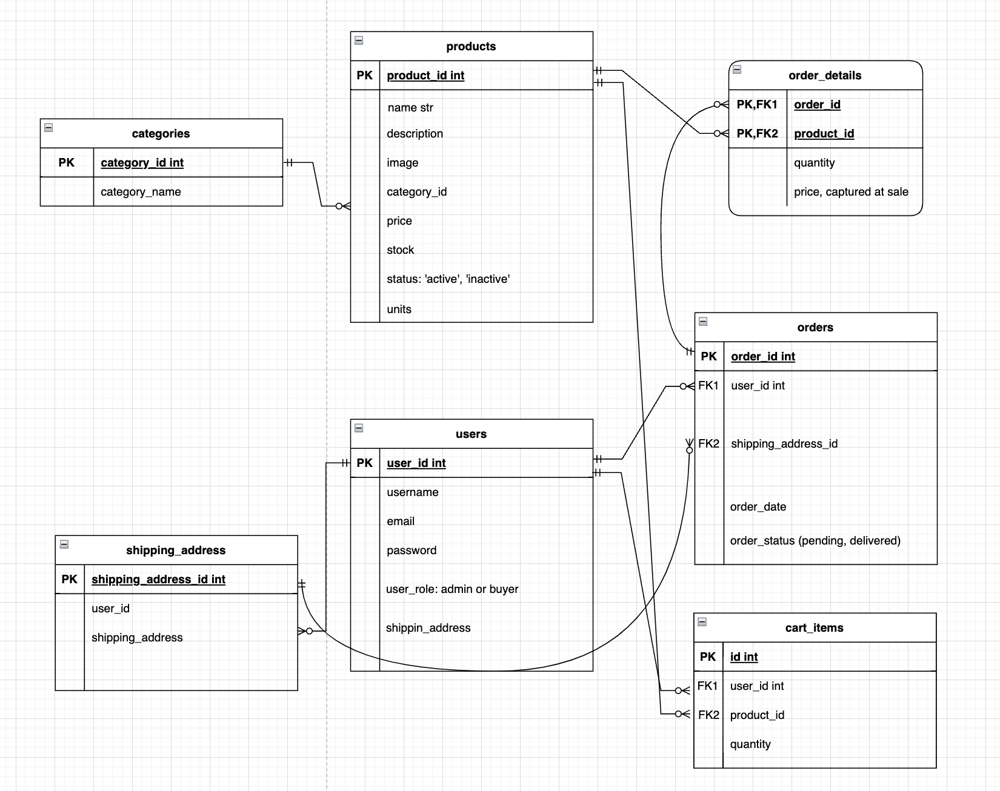
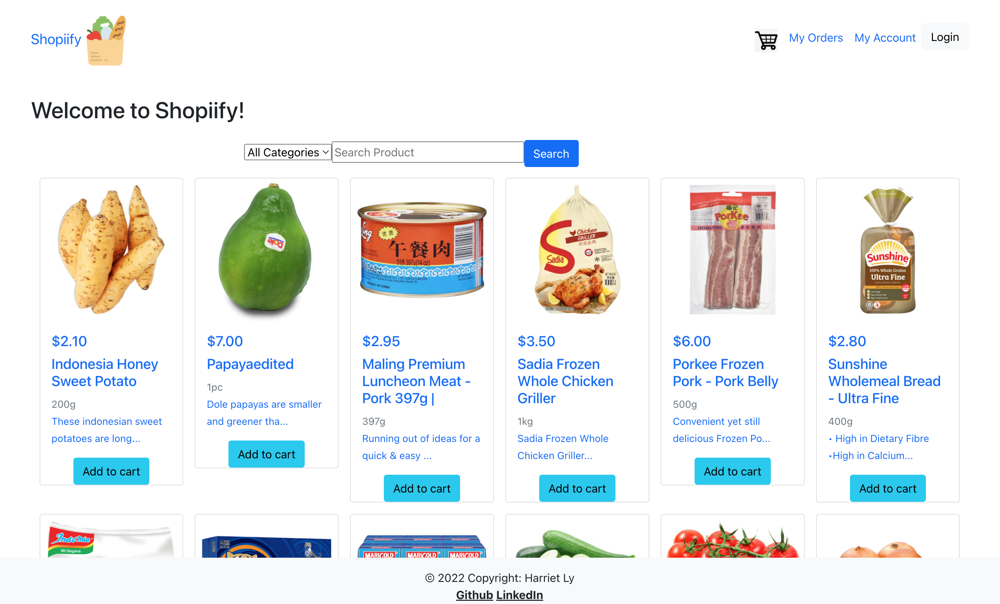
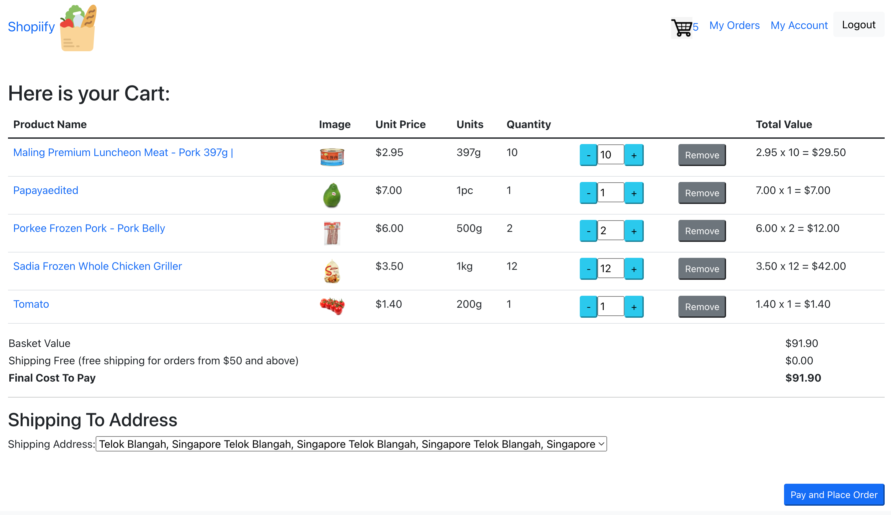
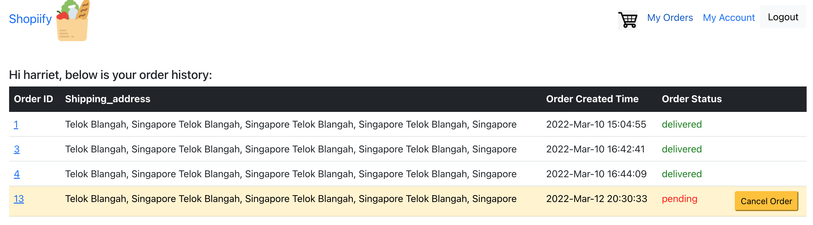
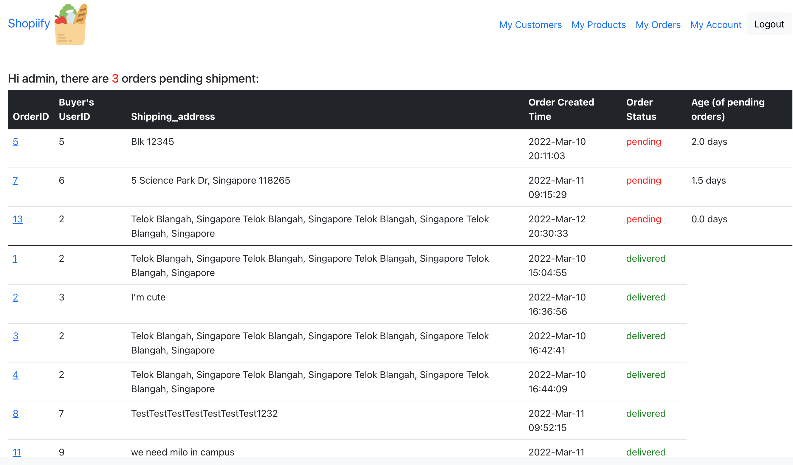
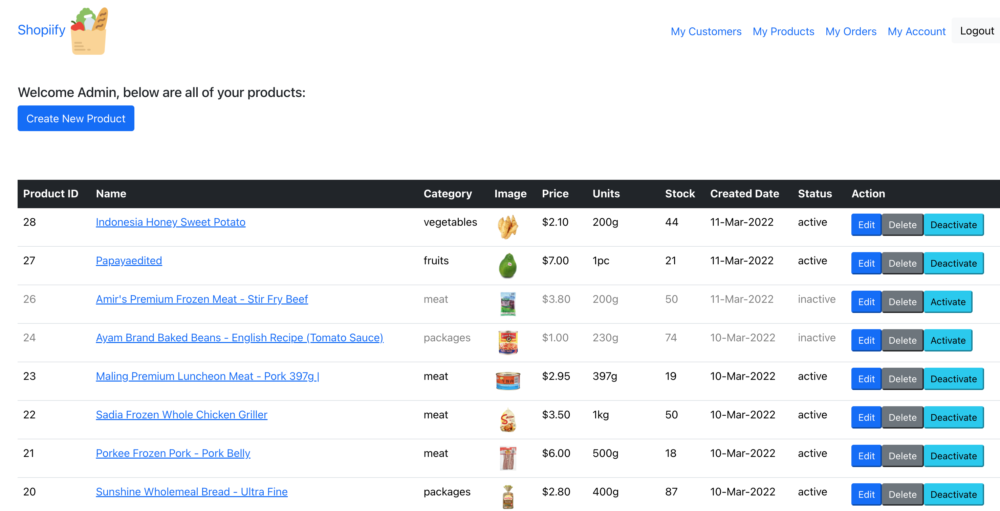

#Front end to shopiify app built using React

Link to the web app:
https://shopiify-harriet.herokuapp.com/

PostgreSQL Database Schema

Screenshots of features:
1. Buyer Homepage

2. Cart and Checkout Page

3. Buyer Orders

4. Admin Orders

5. Admin Products
